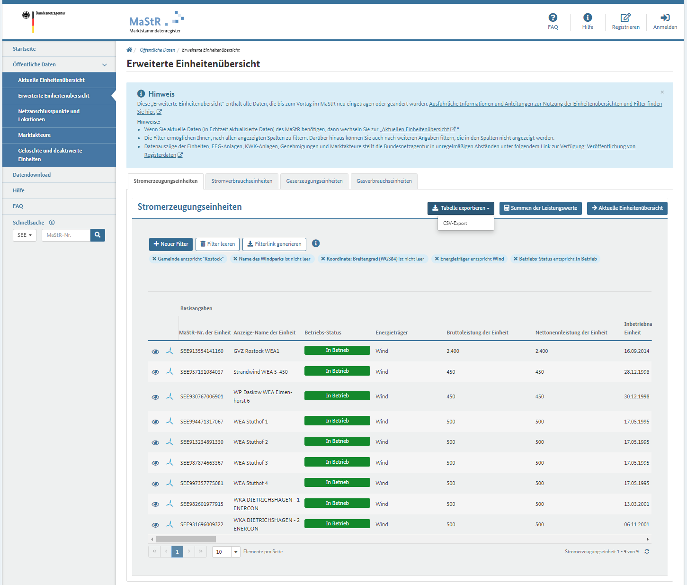

# cumulocity-mastr-wec-import

The Federal Network Agency (German: Bundesnetzagentur or BNetzA) is the German regulatory office for electricity, gas, telecommunications, post and railway markets.
It also gives transparency to the public with a registry "MaStr" Markstammdatenregister.

This is a small node.js application which allows to read the exported csv files from MaStR and creates an asset structure out of it and create it on Cumulocity. Currently the script is focusing on wind turbines, could also be extendet to other assets like solar, bio-gas etc.

In addition the asset model is defined via Cumulocity Digital Twin Manager. Import [Asset Model file](/assetmodel/Export-asset-models.json)

The CSV file can be downloaded via https://www.marktstammdatenregister.de/MaStR/Einheit/Einheiten/ErweiterteOeffentlicheEinheitenuebersicht

It is important to use the extendet "Erweitert" to get all informations like geo location etc.

# How to run the scirpt

## Clone the repository

## Install
  
`npm install`

## Export an CSV

Go to 

https://www.marktstammdatenregister.de/MaStR/Einheit/Einheiten/ErweiterteOeffentlicheEinheitenuebersicht

Configure your filter with following default filter attributes:

* Betriebs-Status entspricht In Betrieb
* Energieträger entspricht Wind
* Koordinate: Breitengrad (WGS84) ist nicht leer
* Name des Windparks is nicht leer

Custom attributes (here you can select by region etc.):
* Gemeinde entspricht *
* Postleitzahl entspricht *



After you have selected you wind turbines you want to export. Click on:


It is important that the csv file is in UTF-8. Please change the encoding if necessary.

The csv file can be copied to import folder and should be changed int the app.js

```javascript
function processCSVFile() {
    fs.createReadStream('import/wec_rostock_20231026.csv')

```

## Configure your Cumulocity tenant

[.env file](/.env)

## Run the srcipt

`npm start`

